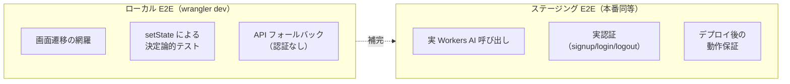

# E2E テスト戦略

## ローカル vs ステージングの責務分担

| 観点 | ローカル | ステージング |
|------|---------|------------|
| 目的 | 画面遷移・UI ロジックの検証 | AI・認証など外部依存の検証 |
| 実行タイミング | CI（毎 push） | workflow_dispatch（手動） |
| AI | フォールバック（401 即返却） | 実 Workers AI |
| 認証 | setState でモック | 実 API（signup/login） |
| 速度 | 高速（~8秒） | 中速（~10-60秒、AI 待ち含む） |

## テストフロー一覧

### ローカル E2E（4本）

```mermaid
graph TD
  subgraph T1["1. 書く → 図鑑登録 → 詳細表示"]
    T1A[みつける] --> T1B[Write<br>1文字・drew済] --> T1C[Reveal<br>ずかんに のったよ] --> T1D[Zukan<br>1けん] --> T1E[Detail<br>emoji+語]
  end

  subgraph T2["2. 保護者ゲート → メニュー → 仕込み"]
    T2A[親ゲート<br>長押し] --> T2B[Parent Menu<br>学習記録] --> T2C[未登録→signup] --> T2D[登録後→Prep] --> T2E[ランダム候補] --> T2F[仕込み確定]
  end

  subgraph T3["3. ひみつのことば → 発見モード"]
    T3A[Zukan<br>seeded語] --> T3B[? タップ] --> T3C[Write<br>mitsuke 2文字] --> T3D[hakkengen<br>フォールバック] --> T3E[Reveal<br>みつけた]
  end

  subgraph T4["4. たんけん → 辞書語 → 登録"]
    T4A[Tanken<br>50音] --> T4B[語組立<br>うし] --> T4C[Write<br>2文字] --> T4D[Reveal<br>辞書語即登録]
  end
```

### ステージング E2E（3本）

```mermaid
graph TD
  subgraph S1["1. 認証ライフサイクル"]
    S1A[signup<br>ユニークメール] --> S1B[me 確認<br>id あり] --> S1C[logout] --> S1D[re-login] --> S1E[logout] --> S1F[me 確認<br>authed=false]
  end

  subgraph S2["2. はっけんフロー（実 AI）"]
    S2A[Home] --> S2B[親メニュー<br>→ Prep 確認] --> S2C[Zukan<br>seeded 語] --> S2D[Write<br>mitsuke 2文字] --> S2E[hakkengen<br>Workers AI] --> S2F[Reveal<br>みつけた⭐]
  end

  subgraph S3["3. おはなしフロー（実 AI）"]
    S3A[Home<br>collected 3語] --> S3B[StoryPick<br>語選択] --> S3C[Story API<br>AI生成] --> S3D[絵本表示]
  end
```

## 設計原則

- **ローカルは網羅性**、**ステージングは外部依存の実証**に集中する
- ステージングではローカルで既に検証済みの画面遷移を重複して検証しない
- AI 呼び出しを含むテストはタイムアウトを長めに設定（60秒）
- ステージング E2E は本数を抑え、実行コストと信頼性のバランスを取る
