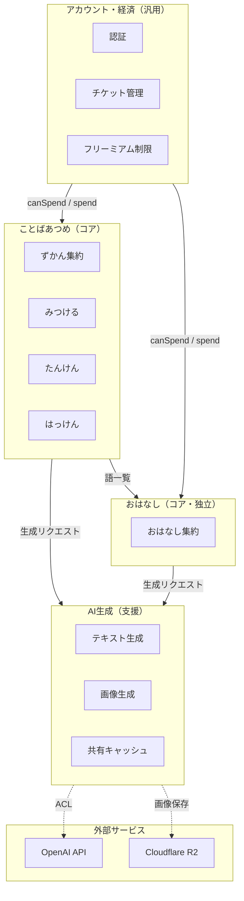

# コンテキストマップ

もじずかんの4つの境界づけられたコンテキストと、その統合パターン。

> 出典: [ADR-0001](../adr/0001-domain-model-and-bounded-contexts.md)

## 全体図

## 統合パターン

| 上流 | 下流 | パターン | インターフェース |
|------|------|---------|----------------|
| ことばあつめ | おはなし | Published Language | 語一覧（zukanWords） |
| ことばあつめ | AI生成 | Customer-Supplier | `POST /api/hakken/generate`（word + style） |
| おはなし | AI生成 | Customer-Supplier | `POST /api/story/stream`（words） |
| アカウント・経済 | ことばあつめ | Conformist | `canSpend(balance)` / `spendTicket()` |
| アカウント・経済 | おはなし | Conformist | `canSpend(balance)` / `spendTicket()` |
| OpenAI API | AI生成 | ACL（腐敗防止層） | `generateJsonOpenAI()` でAPIの不安定性を遮断 |
| Cloudflare R2 | AI生成 | ACL | R2 バインディング経由で画像を保存・配信 |

## コンテキストの分類と自律度

| コンテキスト | 分類 | 変更時のレビュー要否 |
|-------------|------|-------------------|
| ことばあつめ | コア | 必須。不変条件・課金ロジック・UXフローの変更は人間レビュー |
| おはなし | コア（独立） | 必須。ただし、ことばあつめへの影響がないため変更範囲は限定的 |
| AI生成 | 支援 | API差し替え・プロンプト調整は自律的に可。ADRの設計意図は守る |
| アカウント・経済 | 汎用 | チケット消費ルールの変更は売上に直結するため人間判断 |

## 共有キャッシュの位置づけ

共有キャッシュは AI生成コンテキスト内のインフラ層。ドメインロジックではない。

- キャッシュの有無は**パフォーマンスにのみ影響**し、はっけんの可否には関係しない
- 保護者のことば準備を助ける（ランダム候補の提案元）が、はっけんの前提条件ではない
- 詳細は [ADR-0001 §共有キャッシュはインフラ層](../adr/0001-domain-model-and-bounded-contexts.md) を参照
